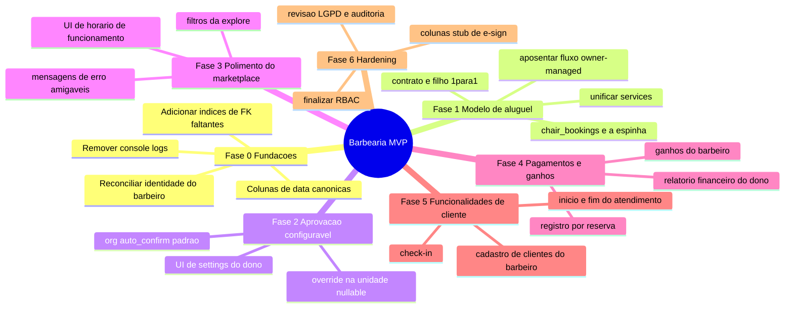
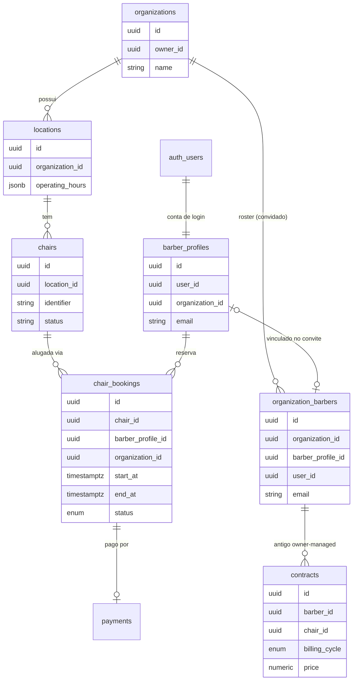
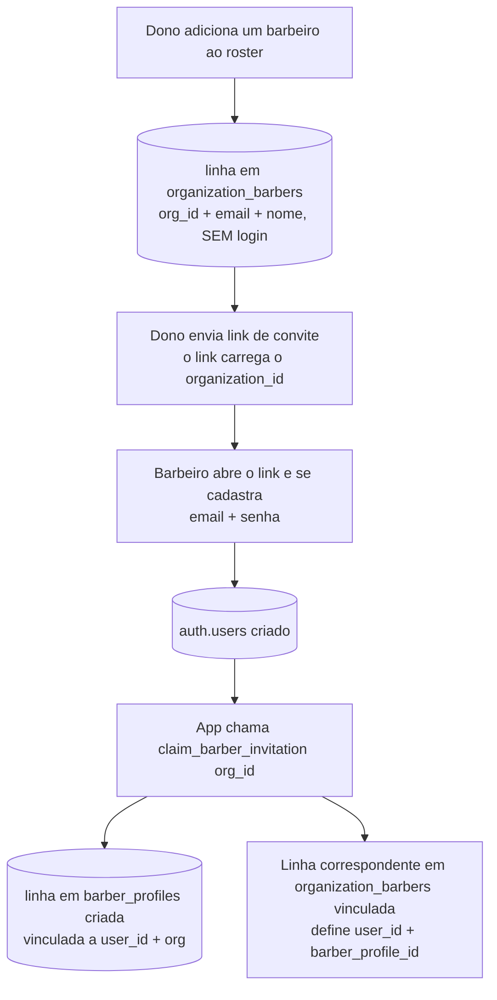
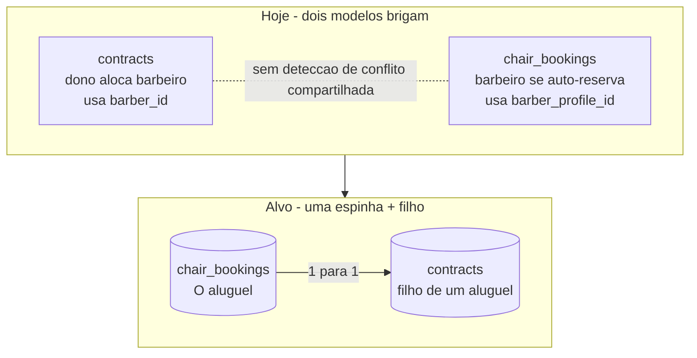
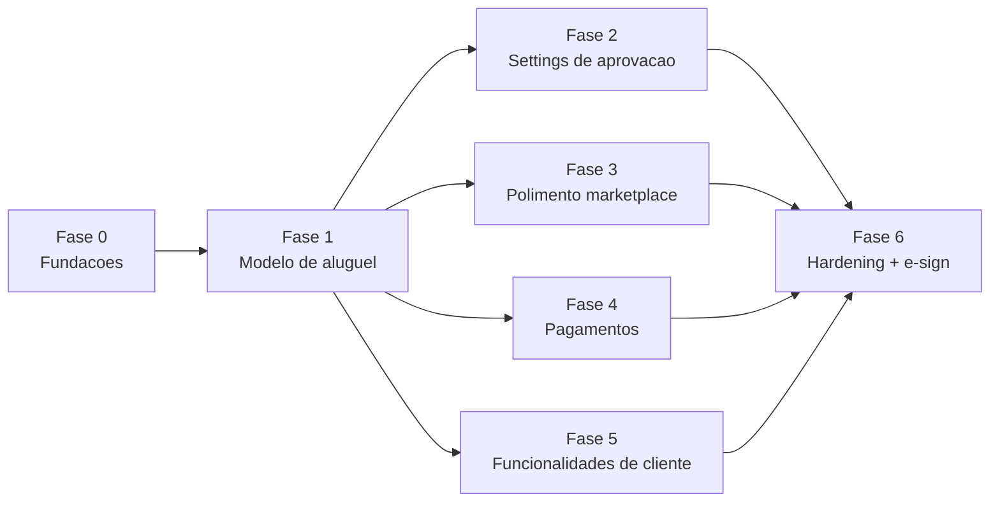

# 🗺️ Barbearia — Análise de Arquitetura & Roadmap de Desenvolvimento

> **Público-alvo:** o(a) estagiário(a) que vai implementar as funcionalidades (com apoio de IA).
> **Papel do autor:** Product Manager (planejamento, não codificação).
> **Última atualização:** 17/06/2026

Este documento explica **como o sistema funciona hoje**, as **decisões de produto** já fechadas e um **roadmap em fases** para concluir um MVP polido. Os diagramas usam [Mermaid](https://mermaid.js.org/) e são renderizados automaticamente no GitHub.

> 📄 Versão em inglês (fonte canônica): [`ROADMAP.md`](ROADMAP.md).

---

## 1. O produto em uma frase

Um **marketplace multi-tenant** onde donos de barbearia disponibilizam **cadeiras** em suas **unidades (locations)**, e **barbeiros** independentes buscam e **alugam** essas cadeiras — cada aluguel gerando um **contrato**.

### Decisões de produto fechadas (17/06/2026)

| Tema | Decisão |
|------|---------|
| **Tenancy** | **Marketplace** multi-tenant de verdade — vários donos, barbeiros alugam em diferentes organizações. |
| **Aluguel ↔ contrato** | O **aluguel da cadeira é a fonte da verdade**. Cada aluguel tem **um contrato (1:1)**. Contratos recorrentes ficam para depois. |
| **Fluxo de reserva** | Barbeiro **self-service, confirmação instantânea por padrão**, mas **configurável** (padrão no nível da organização → override no nível da unidade). |
| **Onboarding do barbeiro** | O dono cria um registro no roster (sem login) → envia **link de convite** → o barbeiro **se cadastra** e a conta é vinculada via `claim_barber_invitation()`. Manter este fluxo como projetado. |
| **Dinheiro / repasses** | Cada dono/organização lida com o dinheiro **fora da plataforma** por enquanto. Sem repasse entre organizações neste MVP. |
| **Nomenclatura** | Renomear a tabela `barbers` → **`organization_barbers`** (é um roster por organização, não "todos os barbeiros"). Tarefa documentada na Fase 0. |
| **Assinatura eletrônica** | Dropbox Sign previsto **perto da produção** — projetar pensando nele, mas não construir agora. |

---

## 2. Roadmap em um relance (mapa mental)

---

## 3. Como o sistema funciona hoje

### 3.1 Stack técnica

- **Frontend:** React 18 + TypeScript + Vite, Tailwind + shadcn/ui, React Router, React Query (subutilizado).
- **Backend:** Supabase (PostgreSQL + Auth + Row Level Security). Sem API própria — o frontend fala direto com o Supabase, com uma fina camada de queries em `src/services/*.ts`.
- **Dois apps no mesmo código:** Portal do Dono/Admin (`/*`) e Portal do Barbeiro (`/barber/*`).

### 3.2 Modelo de dados principal (hoje)

### 3.3 ⭐ `barbers` (→ `organization_barbers`) vs `barber_profiles` (importante)

São **duas coisas diferentes**, e confundi-las é a maior fonte de confusão do projeto.

> **Decisão de nomenclatura:** a tabela `barbers` será renomeada para **`organization_barbers`**, porque ela **não** guarda "todos os barbeiros" — ela guarda o **roster** de barbeiros de uma organização (convidados e, depois, ativados). O nome `barbers` engana, dando a impressão de ser uma lista global. Ver Fase 0.

**O fluxo real de onboarding (como projetado — manter):**

| | `organization_barbers` (hoje: `barbers`) | `barber_profiles` |
|---|---|---|
| **Criado por** | O dono (adiciona alguém ao roster) | O barbeiro, via convite no cadastro |
| **Tem login/senha?** | ❌ Não | ✅ Sim (vinculado a `auth.users`) |
| **Escopo** | Uma linha **por organização** à qual o barbeiro pertence | Uma conta **global** por pessoa |
| **Usado por** | `contracts.barber_id` (legado owner-managed) | `chair_bookings.barber_profile_id` (self-service) |
| **Significado** | "Um barbeiro cadastrado na minha barbearia (convidado / ativo)" | "Um usuário real da plataforma que pode logar e alugar" |

**Como se conectam:** o dono pré-cadastra a linha do roster; quando o barbeiro se cadastra pelo link de convite, a função `claim_barber_invitation()` cria a conta em `barber_profiles` e grava `user_id` + `barber_profile_id` na linha correspondente do roster (correspondência por organização + email).

**Implicação do marketplace:** o ator real é `barber_profiles` (uma pessoa, aluga em várias organizações). `organization_barbers` é o registro de **matrícula/convite por organização** — manter exatamente como projetado, mas ele **não** deve ser obrigatório para *alugar uma cadeira* (o aluguel é dirigido por `barber_profiles`). É por isso que a **Fase 1 move `contracts` para `barber_profile_id`.**

### 3.4 O problema central: dois modelos de aluguel concorrentes

**O que já está bom** (não reconstruir):
- Constraints GIST de exclusão impedem reservas sobrepostas **por cadeira** e **por barbeiro**.
- Um mínimo de 4 horas de aluguel é garantido no banco.
- `locations.operating_hours` (JSONB) + função de validação + trigger já rejeitam reservas fora do horário. O que **falta é a UI para gerenciar os horários**, não a validação.

---

## 4. Roadmap em fases

> As fases 0 e 1 são o **caminho crítico** — faça-as primeiro e com cuidado. O resto é mais mecânico e pode ser paralelizado.

### Fase 0 — Fundações & limpeza
**Objetivo:** remover ambiguidades que tornam cada tarefa futura arriscada.

- [ ] Escrever um `ARCHITECTURE.md` curto: *um barbeiro = `barber_profiles`; um aluguel = `chair_bookings`; um contrato = filho de um aluguel.*
- [ ] Definir `barber_profiles` como o barbeiro canônico; tratar `organization_barbers` como o roster/convite por organização.
- [ ] **Renomear `barbers` → `organization_barbers`** (uma migration). Renomear **somente a tabela**, mais suas policies de RLS, a função `claim_barber_invitation()` e as referências ao nome da tabela no frontend. **NÃO mexer em `contracts.barber_id` aqui** — a Fase 1 apaga essa coluna, então tocá-la agora é esforço jogado fora e revisão dobrada. PR único e isolado.
- [ ] **Confirmar que `barber_profiles.organization_id` aceita `NULL`** (`NULL` = barbeiro global de cadastro próprio, preenchido = convidado + vinculado a uma organização). O aluguel entre organizações usa `chair_bookings.organization_id`, **nunca** a org do próprio perfil. Se a coluna em produção estiver `NOT NULL`, criar uma migration para torná-la nullable — caso contrário barbeiros globais ficam bloqueados.
- [ ] Padronizar em `start_at` / `end_at` (timestamptz); deprecar `contracts.start_date` / `end_date`.
- [ ] Remover `console.log`s de produção (`useAuth.tsx`, `useOrganization.tsx`, etc.).
- [ ] Adicionar os 4 índices de FK faltantes (script já está no `PROJECT_STATUS.md`).

**Aceite:**
- `ARCHITECTURE.md` existe.
- `tsc` reporta **zero erros**; **nenhum `console.log`** restante em `src/`.
- Os 4 índices de FK existem (verificar via query em `pg_indexes`).
- `barber_profiles.organization_id` é nullable; um barbeiro com `organization_id = NULL` pode ser criado.
- Tabela renomeada; **nenhuma alteração em `contracts.barber_id` neste PR.**

**Como testar:** rodar a migration em uma **branch** do Supabase, seedar um barbeiro global (`organization_id = NULL`) e um barbeiro convidado, confirmar que ambos inserem; rodar `tsc` e um `grep` por `console.log` em `src/`.

### Fase 1 — Consolidar o modelo de aluguel (a decisão central)
**Objetivo:** `chair_bookings` é a espinha do aluguel; cada aluguel tem exatamente um contrato.

> **Sem dados para migrar.** O banco **ainda não tem dados reais de produção**, então **não há backfill**. Os contratos legados owner-managed (sem reserva-pai em `chair_bookings`) são simplesmente **apagados**; `contracts` é reconstruído limpo como filho das reservas. Isso elimina o passo de migration mais arriscado.

- [ ] Migration: **apagar as linhas legadas de `contracts`** (owner-managed, sem reserva-pai). Depois remover a coluna `contracts.barber_id`, agora sem uso.
- [ ] Migration: adicionar `contracts.booking_id uuid UNIQUE NOT NULL REFERENCES chair_bookings(id)`.
- [ ] Migration: adicionar `contracts.barber_profile_id` (obtido da reserva-pai, sem backfill necessário).
- [ ] Triggers (ver tabela de ciclo de vida abaixo): no **status da reserva → confirmada**, criar o contrato; no **status → cancelada/rejeitada**, anulá-lo.
- [ ] Aposentar a UI de "dono atribui contrato" (`ContractsPage.tsx`) ou transformá-la em uma visão somente-leitura derivada das reservas.
- [ ] Unificar `contracts.ts` / `barberBookings.ts` / `chairBookings.ts` em um único service de reservas.
- [ ] **RLS no mesmo PR:** adicionar/atualizar policies para as novas colunas `contracts.booking_id` / `barber_profile_id` e quaisquer caminhos de leitura cross-org do marketplace (não adiar segurança para a Fase 6).

**Ciclo de vida do contrato (status da reserva → contrato):**

| Status da reserva | Linha do contrato | Estado do contrato |
|---|---|---|
| pending | nenhuma | — (sem contrato até confirmar) |
| confirmed | existe | active |
| cancelled / rejected | existe (se já foi confirmada) | **voided** (anulação leve — linha mantida para auditoria / e-sign futuro, nunca apagada de fato) |
| completed | existe | fulfilled |

> O trigger de criação dispara na **transição de status → confirmada**, o que cobre **tanto** a aprovação pelo dono **quanto** a confirmação instantânea. O trigger de anulação dispara na transição **→ cancelada/rejeitada**. Contratos são anulados de forma leve (mudança de status), nunca apagados — são registros legais.

**Aceite:**
- Confirmar uma reserva gera **exatamente um** contrato (`booking_id` preenchido, único).
- Uma reserva pending **não** tem contrato; aprová-la então cria um.
- Cancelar/rejeitar uma reserva confirmada muda o contrato dela para `voided` (linha ainda presente).
- Nenhum código grava um "aluguel" que não seja uma linha em `chair_bookings`; `MeusBookings` e `MeusContratos` leem da mesma fonte.

**Como testar:** em uma branch do Supabase — criar uma reserva sob uma org de **confirmação instantânea** (esperar 1 contrato), criar uma sob uma org **pending** (esperar 0, depois aprovar → 1), cancelar uma confirmada (esperar contrato `voided`, linha presente). Verificar RLS: um barbeiro vê apenas os próprios contratos.

### Fase 2 — Aprovação configurável (org → unidade)
**Objetivo:** confirmação instantânea por padrão, com possibilidade de override.

- [ ] `organizations.auto_confirm_bookings boolean NOT NULL DEFAULT true`.
- [ ] `locations.auto_confirm_bookings boolean NULL` (`NULL` = herda).
- [ ] Regra de resolução: `COALESCE(location.setting, org.setting)` → `confirmed` ou `pending`.
- [ ] UI do dono: toggle na organização + override por unidade (Herdar / Ligado / Desligado).
- [ ] **RLS no mesmo PR:** apenas o dono da organização pode gravar os settings de `auto_confirm_bookings` dela.

> **Nota do PM:** usamos de propósito a herança simples via `COALESCE` agora e adiamos um motor completo de herança de settings até existirem 5+ settings herdáveis. Os dados armazenados continuam compatíveis.

**Aceite:** o toggle da organização muda o status das novas reservas; um override de unidade prevalece sobre o padrão da organização.

**Como testar:** org `auto_confirm = true` → nova reserva fica `confirmed` (e ganha contrato, conforme Fase 1); org `false` → nova reserva fica `pending`; uma unidade com `Ligado` enquanto a org está `false` → essa unidade confirma na hora, as outras seguem pending.

### Fase 3 — Polimento do marketplace & horários de funcionamento
- [ ] UI de CRUD de horários de funcionamento para o dono (a validação já existe no banco).
- [ ] Página Explore: filtrar por cidade / unidade / data / hora usando `vw_public_chair_explore`.
- [ ] Mensagens de erro amigáveis para violações de horário / sobreposição / mínimo de 4h.

**Aceite:** dono marca domingo como fechado → barbeiro não consegue reservar no domingo, com mensagem clara; filtros da Explore retornam disponibilidade correta.

### Fase 4 — Pagamentos & ganhos atrelados aos aluguéis
> **Nota de escopo:** o dinheiro é tratado **fora da plataforma** neste MVP. Esta fase é **apenas registro** — sem gateway de pagamento, sem repasse entre organizações. Registramos *o que é devido / foi pago* para que donos e barbeiros tenham um extrato preciso; a liquidação acontece fora do app.

- [ ] **Discovery primeiro:** documentar o que o `payment_system_v2` realmente é (tabelas, colunas, o que grava nele, está em uso) antes de mudar qualquer coisa. Produzir uma nota de 1 parágrafo; só então decidir manter / mesclar / descartar.
- [ ] Garantir que `payments.booking_id` é o vínculo canônico; reconciliar o `payment_system_v2` conforme o resultado do discovery.
- [ ] Ganhos do barbeiro + relatório financeiro do dono leem de reserva → pagamento.
- [ ] Status de pagamento é um campo manual/registrado (ex.: `pending` / `paid`), não um callback de gateway.

**Aceite:** cada reserva confirmada tem um registro de pagamento; ganhos e relatórios batem a partir de reserva → pagamento.

### Fase 5 — Funcionalidades voltadas ao cliente do barbeiro (F010–F012)
- [ ] Check-in do cliente na unidade.
- [ ] Início / fim do atendimento.
- [ ] Cadastro de clientes próprio do barbeiro + histórico.

*Autocontido; pode rodar em paralelo assim que a Fase 1 estiver pronta.*

### Fase 6 — Hardening de produção + preparação para e-sign
- [ ] Finalizar RBAC (F003: gerente, recepção, permissões granulares).
- [ ] Revisão de LGPD / log de auditoria.
- [ ] Adicionar colunas stub `contracts.esign_status` / `esign_envelope_id` (sem integração ainda).

---

## 5. Fluxo de dependências

---

## 6. Decisões resolvidas (antes: perguntas em aberto)

1. ✅ **Manter a tabela de roster.** `organization_barbers` (renomeada de `barbers`) permanece como projetada: dono cria a linha do roster → envia link de convite → barbeiro se cadastra e é vinculado via `claim_barber_invitation()`. Não será substituída.
2. ✅ **Dinheiro fora da plataforma.** Cada dono/organização liquida o dinheiro fora do app neste MVP. Sem repasse entre organizações. A Fase 4 é apenas extrato/registro.
3. ✅ **Docs nos dois idiomas.** O inglês (`ROADMAP.md`) é a fonte; uma cópia em português (pt-BR) é mantida em `ROADMAP.pt-BR.md` para o(a) estagiário(a).
